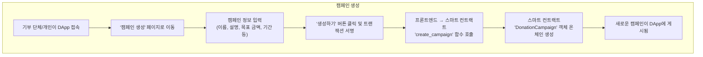
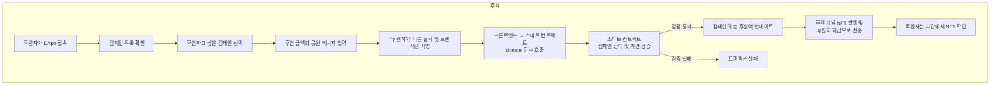
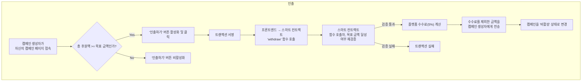

# 2025-Blockthon DApp Workflow

This document outlines the key workflows of the donation DApp.

## 1. Campaign Creation Workflow

This diagram shows the process of a user creating a new donation campaign.

## 2. Donation Workflow

This diagram shows the process of a user donating to a campaign and receiving an NFT.

## 3. Withdrawal Workflow

This diagram shows the process of a campaign organizer withdrawing the collected funds.

